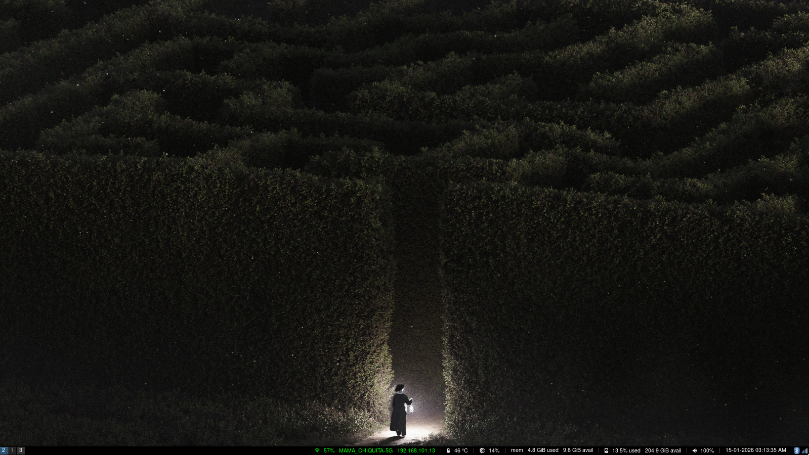
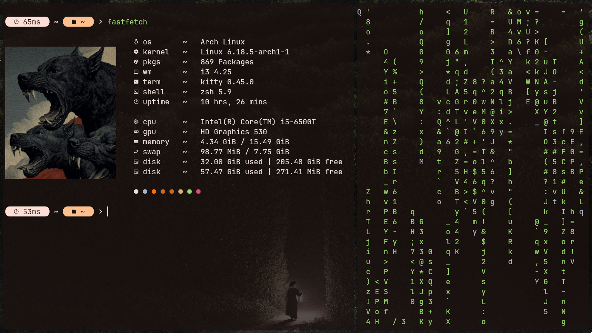
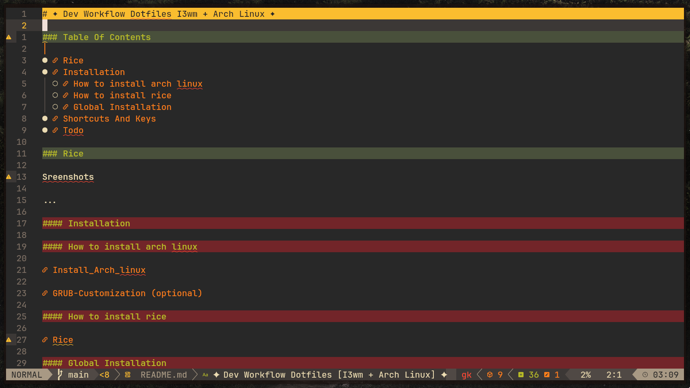
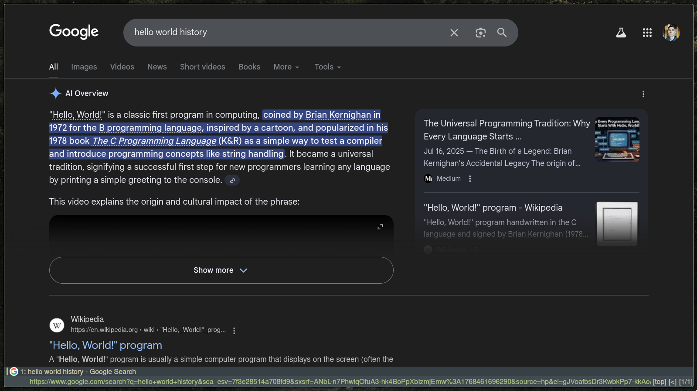
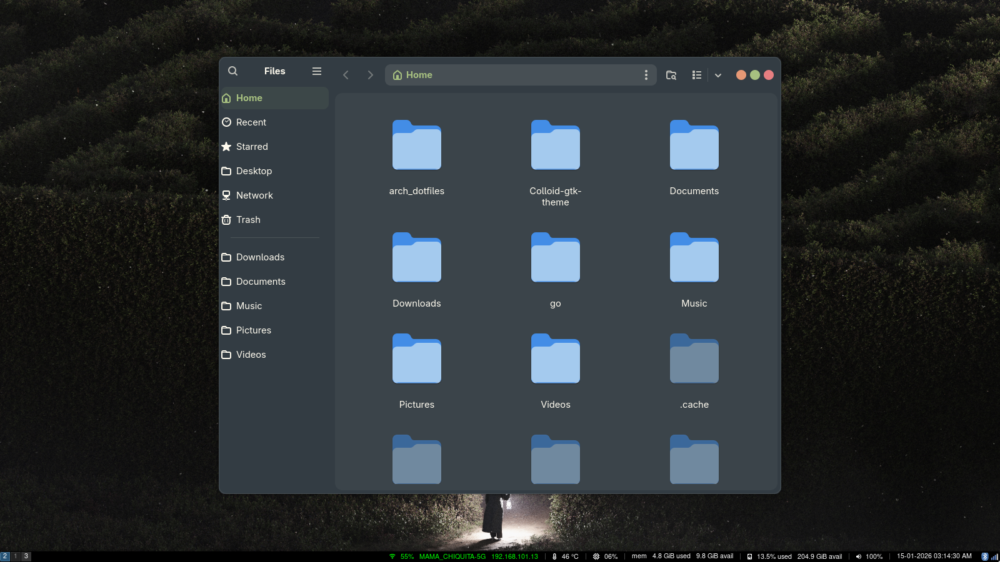
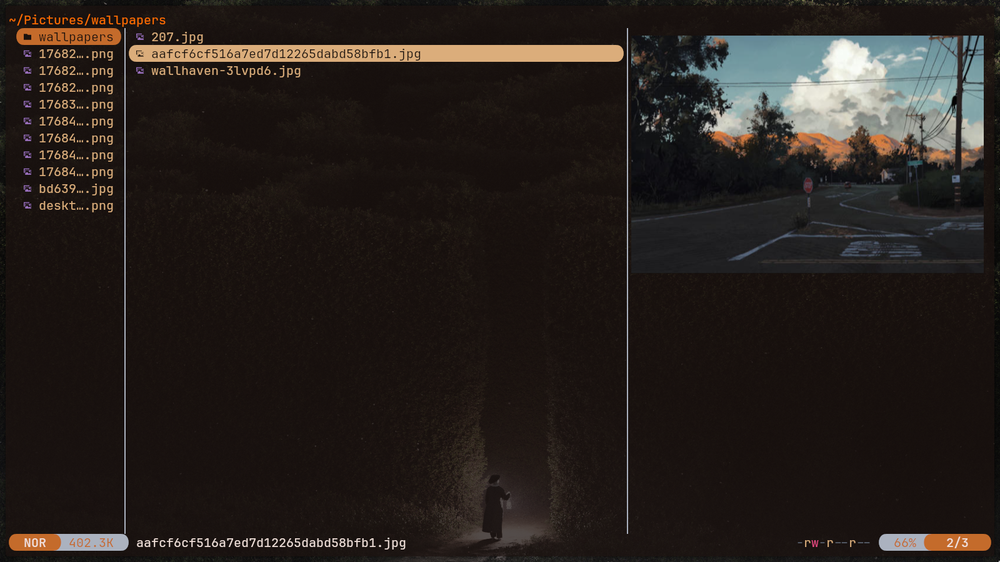

# ✦ Dev Workflow Dotfiles [I3wm + Arch Linux] ✦

### Table Of Contents

- [Rice](#rice)
- [Installation](#installation)
  - [How to install arch linux](#how-to-install-arch-linux)
  - [How to install rice](#how-to-install-rice)
  - [Global Installation](#global-installation)
- [Shortcuts And Keys](#shortcuts-and-keys)
- [FAQS](#faqs)
  -[Rice Story](#rice-story)
  -[Why This Rice?](#why-this-rice?)
- [Todo](#todo)

### Rice

**Sreenshots**

<table border="0">
 <tr>
    <td></td>
    <td></td>
    <td></td>
 </tr>
 <tr>
    <td></td>
    <td></td>
    <td></td>
 </tr>
</table>

#### Installation

#### How to install arch linux

[Install_Arch_linux](./installation/Install_Arch_linux.md)

[GRUB-Customization (optional)](/installation/GRUB-Customization.md)

#### How to install rice

[Rice](./installation/Rice.md)

#### Global Installation

[1. enable_multilib.sh](./installation/enable_multilib.sh)

[2. Essentials](/installation/Essentials.md)

[3. Development_Env](./installation/Development_Env.md)

[4. File_Explorers](./installation/File_Explorers.md)

[5. Browsers](./installation/Browsers.md)

[6. Applications](/installation/Applications.md)

### Shortcuts And Keys

**Distro**

| Shortcut | Description                |
| :-------- | :------------------------- |
| `Ctrl+Space` | Open Spotlight |

**Neovim / Lazyvim**

| Shortcut | Description                |
| :-------- | :------------------------- |
| `<leader>ql` | Restore the last session for the current working directory. |

**Qutebrowser**

| Shortcut | Description                |
| :-------- | :------------------------- |
| `Ctrl+Space` | Open Spotlight |
| `K` | Go to next tab (your custom swap) |
| `J` | Go to previous tab (your custom swap) |
| `d` | Close current tab |
| `u` | Undo tab closure (reopen last closed tab) |
| `gt` | Display a list of all open tabs |
| `alt+[1-9]` | Jump to tab N |
| `f` | Open link in current tab (Hints mode) |
| `F` | Open link in a new tab (background) |
| `H / L` | Go back / Go forward in history |
| `r / R` | Reload / Reload bypassing cache |
| `j / k` | Scroll down / Scroll up |
| `gg / G` | Go to the top / Go to the bottom of the page |
| `ctrl+f / b` | Page down / Page up |
| `i` | Enter Insert Mode (to type in fields) |
| `kj` | Return to Normal Mode (your custom shortcut) |
| `o / O` | Open URL/Search / Edit current URL |
| `yy` | Copy current URL to clipboard (Yank) |
| `/` | Search for text on the current page |
| `n / N` | Next / Previous search result |
| `:` | Open the command line |
| `:adblock-update` | Update ad-blocking filter lists |
| `:config-source` | Reload config.py to apply changes |
| `W` | Detach current tab to a new window |
| `n` | Open a new empty window |
| `N` | Open a new window with the current URL |
| `ctrl+h / ctrl+l` | Move current tab left / right in the tab bar |
| `v` | Enter Caret Mode (Visual mode for text) |
| `V` | Enter Caret Mode with Line Selection |

### FAQS

#### Rice Story

#### Why this rice?

### Todo

- [ ] Add Neovim Shortcuts table.
- [ ] Update Distro Shortcuts table.
